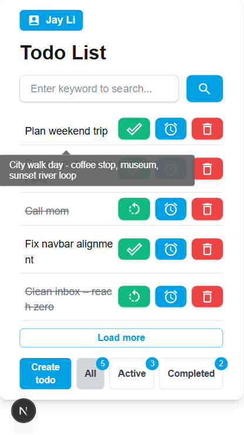
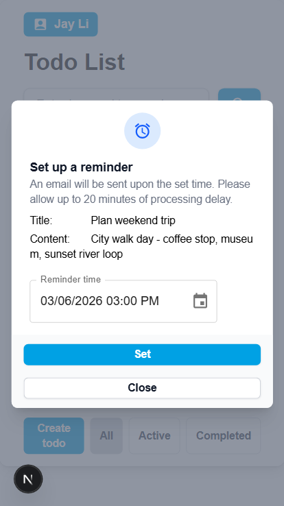

# Todo App

Todo App is a serverless, mobile-friendly task manager with Cognito-backed authentication and email reminders. This repo is the top-level hub that ties together the Next.js (React) frontend, .NET 8 backend, and AWS CDK infrastructure.

<table>
  <tr>
    <td></td>
    <td></td>
  </tr>
</table>

## Repositories
- Frontend (Next.js/React + MUI/Tailwind): https://github.com/Jayli58/todo-app-frontend
- Backend (.NET 8 + Lambda): https://github.com/Jayli58/todo-app-backend
- Infrastructure (AWS CDK): https://github.com/Jayli58/todo-app-infra

## Features
- Add, complete, search, and remove todos
- Authenticated access with Amazon Cognito
- Email reminders via DynamoDB TTL + reminder worker
- Mobile-friendly UI with status filters and pagination

## Architecture
- Frontend hosting: S3 + CloudFront
- Backend API: API Gateway + Lambda + DynamoDB
- Authentication: Cognito hosted auth, JWT validation in the API
- Client flow: React → API Gateway → Lambda → DynamoDB
- Event flow: DynamoDB TTL → DynamoDB Streams → Reminder Lambda → Email service

## Tech stack
- Frontend: Next.js App Router (React), MUI + Tailwind CSS
- Backend: ASP.NET Core Web API on AWS Lambda, DynamoDB
- Auth: Amazon Cognito
- Infra: AWS CDK (TypeScript), S3, CloudFront, API Gateway
- Testing: Jest (frontend), xUnit + Moq (backend)

## CI/CD
- Frontend pipeline: GitHub Actions builds the artifact, syncs to S3, invalidates CloudFront cache.
- Backend pipeline: GitHub Actions uploads artifacts to S3; CodePipeline deploys TodoApiStack and ReminderStack.

## Local development
- Frontend: run `npm run dev` from the frontend repo.
- Backend: run `dotnet run` from the backend repo and use `http://localhost:7273/swagger` for API docs.
- Infra: deploy stacks from the infra repo using `npx cdk deploy`.
